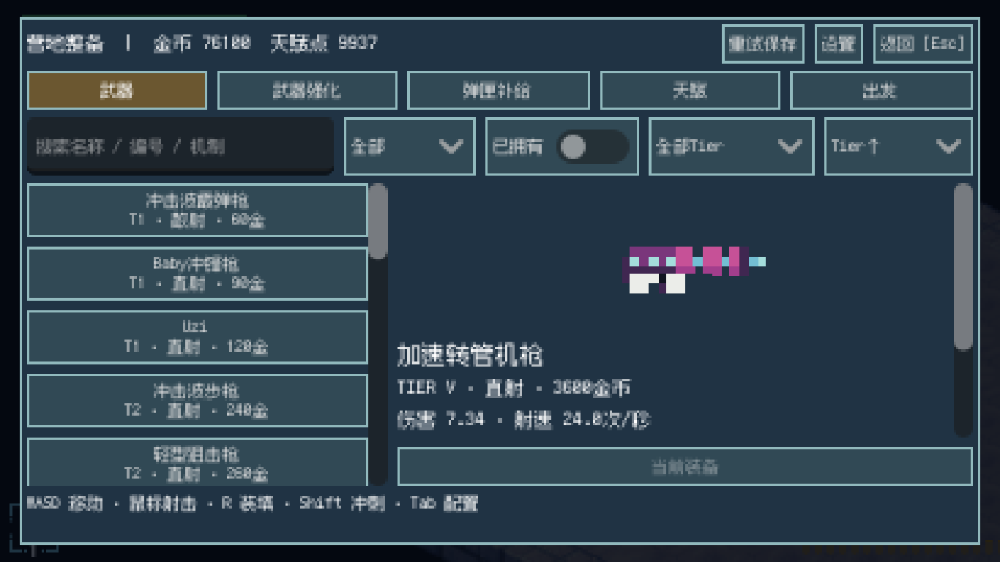
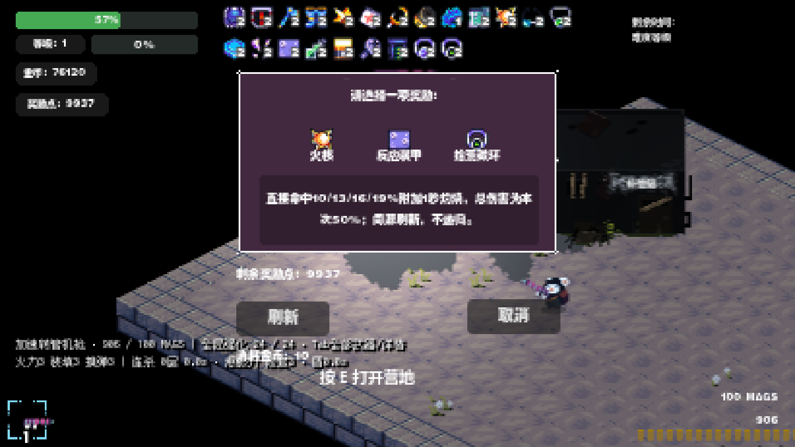
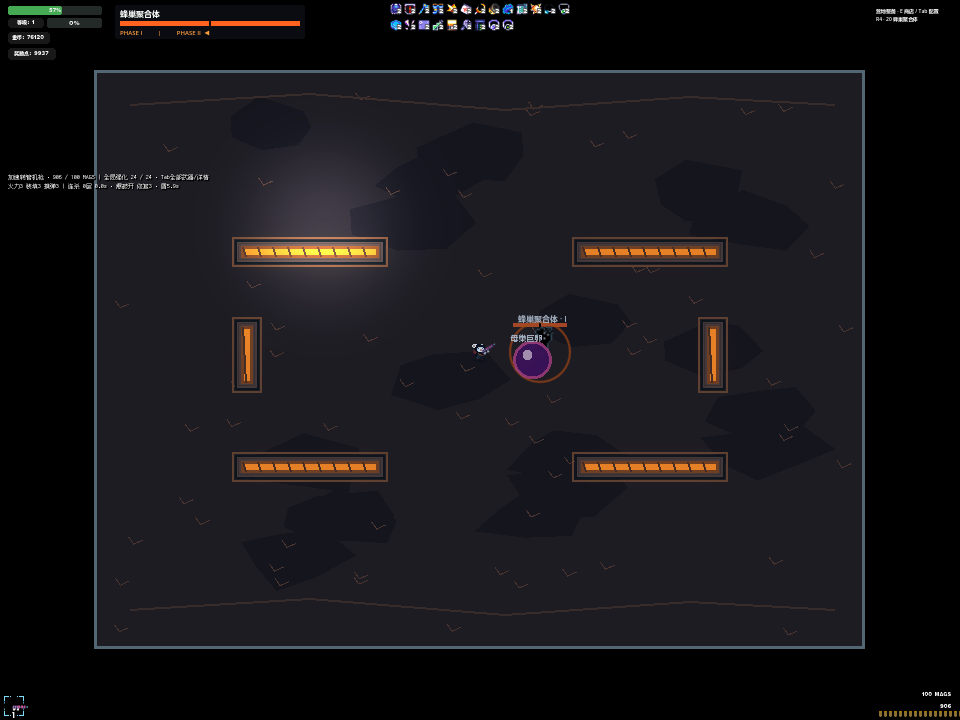

# M10 — CONTENT EXPANSION & FINAL DIFFICULTY TUNING

M10 CONTENT EXPANSION COMPLETE / READY FOR FINAL HUMAN REVIEW

`H1_STATUS = THIRD_FEEDBACK_ADDRESSED`

`HUMAN_ACCEPTED = false`

工程与原生渲染证据已完成；手感、声音、美术观感和最终难度仍等待真人反馈。本报告不把自动移动射击、强制技能采样或高生命压力场景当作真人验收。

## Git 与范围

M9 先独立提交并推送：`3946250809ea369d1dfc856e87476100a6d14f69`。最小原生启动 `m10-anchor-launch` 50 项通过后才开始 M10。M10 第一批 `b0381d7` 保存奖励、成长叠加、价格及存档改动；后续战斗和证据分别提交。最终精确 HEAD 与远端同步结果见交付消息。

分支为 `feat/towdown-experience-upgrade`；没有 merge main、Release 或进入 M11。三个原项目的既有删除、用户计划 ZIP、archive 支持目录及既有无文本差异 shader 状态均不纳入本轮提交。

## 冻结合同与实现

源码对照 M9 anchor：24 枪、12 敌人、3 Boss、6 区域、30 遭遇保持；ENEMIES/BOSSES 全定义（包括 HP）、区域/墙体及武器 POWER/TIERS 均不变。1–5 关遭遇配置逐行相同；E05 加密只在 6 关之后生效。没有以 HP sponge 提难度。机器可读对照：[source-contracts.json](evidence/m10/source-contracts.json)。

6–29 关通过 spawn interval、存活 cap 和角色比例提高压力；16 关后角色序列 60% 为 E01/E02。中点 rush 为 4/6/8 个 E02，逐个间隔 0.3 秒，从同一合法方向进入；正常刷新继续，共享 encounter cap、145–280 距离及原导航路径。召唤也遵守当前 encounter cap。完整配置见 [density-design.json](evidence/m10/density-design.json)。

## 实测敌群密度

45 秒不射击固定位置探针，HP=10000，仅测压力，不能证明可生存。M9 与 M10 同一采样器。29 关第一次 mean +27.3% 未达目标，因此调到 cap 98 / interval 0.27，并复跑最终探针。

| 关 | M9 mean / peak | M10 mean / peak | mean 增幅 | E01/E02 出生占比 | 非法近距正常出生 |
|---|---|---|---|---|---|
| 7 | 27.65 / 42 | 31.66 / 49 | 14.50% | 66.7% | 0 |
| 13 | 23.65 / 32 | 28.14 / 38 | 19.00% | 50.0% | 0 |
| 17 | 26.57 / 36 | 35.51 / 47 | 33.67% | 60.4% | 0 |
| 22 | 32.71 / 42 | 42.39 / 55 | 29.61% | 60.0% | 0 |
| 26 | 49.05 / 65 | 66.46 / 93 | 35.51% | 61.7% | 0 |
| 29 | 50.89 / 70 | 72.52 / 98 | 42.49% | 67.7% | 0 |

7 关 mean +14.50% 接近约 +15% 目标，存活峰值 +16.67%；13 关 +19.00%。17/22 关落在 +25–35%；26/29 关落在 +35–50%。出生占比是实际观察到的实例，包含合法召唤，正常安全距离检测排除召唤子体。早期探针曾把未标注的 E02 召唤当作正常刷新，已统一写入 summoned 元数据并重测最终 29 关。

合法自动游玩使用正常 8 HP、实际移动/换弹/射击，不传送、不无敌：满构筑 124 在 22/26/29 清关，最终加密 29 关再次清关。另加的中等构筑 117、5 强化、有限天赋和 8 个首层新奖励：26 关清关，22 关 15.89 秒、29 关 20.49 秒死亡。该诊断保留为最终真人难度复核重点，没有把失败删掉或把强构筑结果外推为所有构筑均可过。

## Boss / Elite 与大招

Boss 普通入伤倍率 0.97 → 1.1155，精确 +15%；百分比大招绕过该普通伤害增幅。普通 E05 为 5 发扇形；E10 普通/精英 6/12，E11 精英 10 发。全部采用固定扇面、缺口和错位波次，没有随机全方向乱射。

| 攻击 | Phase I | Phase II |
|---|---|---|
| B01 slam | 16 发缺口环 | 2 层错位环，共 40 发 |
| B02 brood | 2 波缺口环，共 42 发 | 3 波，共 75 发 |
| B02 pulse | 2 波错位 fan，共 34 发 | 3 波，共 69 发 |
| B03 burst | 2 波，共 26 发 | 3 波，共 51 发 |
| B03 dash 结束 | 原行为 | 反向 9 发短 fan |

上表是单次完整攻击发射量，不是同时存活量。30 组强制 phase/attack 样本走生产预警和弹体逻辑，见 barrage-v1；强制选择器只在测试内跳过自然选择，大招另测。B02 是整体最密集者；自然高阶试玩 B02 峰值 107，M9 对照曾为 110，不能声称每一次自由战斗的峰值都增加。增加由逐攻击发射量、错位波次和压力场景共同证明。

| 大招 | 预警 | 形态 | 最大 HP 原始比例 |
|---|---|---|---|
| B01 重压震荡 | 1.6 秒 | 半径 160 大范围圆形冲击，一次命中 | 30% |
| B02 母巢巨卵 | 1.6 秒 | 半径 18、速度 75 的巨球，墙体 sweep 阻挡，路径线；命中附束缚 | 28% |
| B03 棱镜坍缩 | 1.5 秒 | 4 臂大交叉 Beam，墙体截断，交点不重复伤害 | 33% |

只在 Phase II 启用，转阶段至少 3 秒后第一次使用；独立 15 秒冷却，boss_ultimate 全局互斥，owner 死亡/epoch 切换销毁。百分比独立入口以当前 max HP 计算，再进入正常盾、减伤及 Reward 回调；单次比例上限 35%。Reactive Plating 只抵消下一次普通伤害，大招不会消耗该普通攻击保护。

M9 没有正式 root 状态（freezeFrame 空实现、短枪械后坐不等于束缚）。M10 root 固定 0.45 秒，结束后免控 1.2 秒；阻止位移/冲刺但保留瞄准、射击、装填，脚下束缚环和文字可见，死亡/换场清理。32 项 Ultimate 检查包含 5/20 max HP、预警不提前伤害、一次命中、盾和阶段/冷却。

| 构筑 | 关 | 清关秒 | 敌弹 peak | 受伤总量 | 大招实际激活 |
|---|---|---|---|---|---|
| high | 10 | 42.38 | 40 | 6.148 | 2 |
| high | 20 | 60.49 | 107 | 6.671 | 2 |
| high | 30 | 58.72 | 55 | 6.076 | 2 |
| full | 10 | 32.40 | 40 | 0.000 | 1 |
| full | 20 | 52.87 | 92 | 1.205 | 2 |
| full | 30 | 43.66 | 55 | 6.076 | 1 |

以上六场 Boss 为 M9 对照所用的合法高阶/满配构筑，不加新 Reward 来伪造更快清关；测试机器人仍不能评价视觉缝隙是否对真人舒服。

## 24 Reward 数值与 stack audit

旧资源 max_count 与旧存档 count 保留，另加 effect cap；新奖励最大层数严格 3 或 4。一次性 ID 0/1 不占 HUD，其余 22 个继续使用原 RewardRoot / RewardTopItem，并显示层数。图标全部取自现有 All_Icons，新 12 个在实现前未被资源引用；[reward-art-manifest.json](evidence/m10/reward-art-manifest.json) 覆盖全部 24 个。没有下载素材或生成写实图。

| ID | 首层实际效果 | 满层有效效果 / 上限 |
|---|---|---|
| 0 | +10 金币（一次性） | 每次购买独立结算，不常驻 |
| 1 | 回复到最大生命（一次性） | 不增加最大生命 |
| 2 | +3 max HP | 前 4 层共 +12；历史 HP 与 count 保留 |
| 3 | 15% 概率抵消少量伤害 | 概率 60%，减伤量最多按 4 层 |
| 4 | 10% 概率直接伤害翻倍 | 100% 概率封顶；保留 BlueAxe 强特色 |
| 5 | +5 移速 | +30 移速，效果 6 层 |
| 6 | 同目标第 3 直接命中附加 5 | 附加最多 30；不递归 |
| 7 | 直接击杀 20% 掉 1HP 包 | 每包最多 3HP |
| 8 | 1 秒内 3 直接击杀：+20pp 射速，2 秒 | 同一 +20pp buff 最多 6 秒，不叠乘 |
| 9 | 每 3 秒充能下一击 +50% | 最多 +150%，消耗充能 |
| 10 | 前 100 直接击杀各 +0.1 max HP | 累计 +10，不随 count 放大；旧历史保留 |
| 11 | 20% 概率附加 25% 伤害 | 20% 概率附加 100%，最多 4 效果层 |
| 12 | 10% 概率 1 秒 burn | 19% 概率；同源刷新，约 50% 命中伤害/完整持续 |
| 13 | 10% 概率 20% 慢速 1 秒 | 22% 概率；同源刷新，多源合计 cap 40%，Boss 缩为 1/4 |
| 14 | 对精英/Boss +5% | +20%；已计入的派生伤害不会再乘一次 |
| 15 | 第 7 直接命中 +35%（均值约 +5%） | 第 5 次 +35%（均值约 +7%） |
| 16 | 暴击后 15% 概率发 2 枚各 12.5% 裂片 | 25% 概率；一代，不能暴击或继续裂片 |
| 17 | 受伤后下一次普通伤害 -20%，6 秒冷却 | 减伤仍 20%，冷却 4 秒 |
| 18 | 每 12 直接击杀回复 0.5HP | 每 8 次；派生击杀不触发 |
| 19 | 低于 30% HP 受伤回复 1HP，20 秒冷却 | 回复 2HP，不复活 |
| 20 | 普通敌人击退 +15% | +60% 冲量，不是 +60% DPS |
| 21 | 每 15 直接击杀 +1 备用弹匣 | 每 10 次，不直接装入当前弹匣 |
| 22 | 连续移动 2 秒后移速/射速 +3% | +9%，停止即消失 |
| 23 | 吸附半径 +40% | +120%，金币价值不变 |

新 Reward 不会单独让所有枪 DPS 翻倍。5–12% / 15–35% 是典型价值指导，不是每条 proc 的硬造数：火核完整 burn 名义期望约 5%→9.5%（低伤害 tick 最低 0.05，刷新/提前死亡会改变收益）；裂片在 100% 暴击且两片全中时上限约 3.75%→6.25%；动量 3%→9% 是双维度条件收益。减速、击退、吸附及治疗不能当作同百分比 DPS。脉冲和保守裂片保留用户要求的触发节奏，不为了凑长期百分比强行放大。

49 项首层/最大购买层数审计逐一实例化全部 24 个；记录 max_count、实际 100 次直接命中总量、burn/slow、HP、移速、射速和吸附，见 [reward-matrix.json](evidence/m10/reward-matrix-final/m10/reward-matrix.json)。该同步事件矩阵不是经过真实时间的 DPS 测试；独立实际射击测试如下。

## 三层成长、派生与保存

普通伤害增益、Crit 百分点与普通冲量分别求和；Crit 最后 clamp 0–100%。射速基础 bucket 为 1 + T02 + Momentum + Amber buff；击杀天赋保留原条件乘区，持续武器把该射速 bucket 转入 tick damage。移速为基础 100 + 天赋 + Boots（最多 30）+ Momentum。

弹匣维持 base × 去重后的各全局 magazine_mul × (1 + legacy + T04)，最后取整；装填维持 base × max(0.1, 1 - legacy - T03) × 各全局 reload_mul，最后执行全局最短装填。这些是原有明确的机制倍率，不误当 Crit 百分点相乘。Hunter 是 Elite/Boss 条件乘区，对已结算伤害的后继 proc 标记 hunter_applied，防止再次放大。

burn/slow 各按来源存储，刷新同源不抹掉另一层。Reward 直接命中/击杀 hook 只接受 depth=0，派生 hit 不再次调用；裂片 depth=1 且 crit/shards 清零；训练目标不刷 kill heal 或弹匣。52 项实际射击/触发审计覆盖 Upgrade / Talent / Reward、回血和弹匣天赋共存，以及 root 中继续射击/装填。

| 实际 6 秒射击组合 | 伤害 | 耗弹/射击计数 |
|---|---|---|
| base | 45.000 | 25 |
| upgrade | 57.240 | 25 |
| talent | 54.080 | 25 |
| both | 66.740 | 25 |
| three | 76.140 | 25 |

233 项成长检查含 A、B、A+B、三层、24 枪真实纹理、100 组三选一、价格、属性、命中、保存重载。schema 6 保持；新 Reward 保存 hit/kill counter、cooldown、armed、移动计时；旧 Amber/Battery 额外保存剩余 buff/充能定时，旧 Bacteria 历史 kill_count 与 count 不截断。连续 3 次 save/load 和重复 refresh 不改变最终属性，不重复授予 HP。

## 商店、NPC 与原 HUD

24 永久强化最低 350，总价 20300；运行时 BaseAttachment.money 统一读取目录价格，修正继承旧场景默认低价的问题。试玩初始金币/天赋点 9999 和补给功能保持，购买与存档正常扣款。

| 强化 ID | 价格 |
|---|---|
| 0 | 500 |
| 1 | 350 |
| 2 | 550 |
| 3 | 800 |
| 5 | 750 |
| 6 | 700 |
| 7 | 450 |
| 8 | 850 |
| 9 | 1500 |
| 110 | 700 |
| 111 | 850 |
| 112 | 650 |
| 113 | 950 |
| 114 | 600 |
| 115 | 700 |
| 116 | 450 |
| 117 | 800 |
| 118 | 1100 |
| 119 | 1200 |
| 120 | 1400 |
| 121 | 900 |
| 122 | 1200 |
| 123 | 850 |
| 124 | 1500 |

24 枪预览均取真实 gun.image，固定 120×60，保持比例、最近邻、不充当购买按钮；原购买交互保留。新奖励卡保留原布局，仅短标题用中文避免小卡双语溢出。22 个常驻奖励使原两行 HUD 与 Boss 血条重叠的问题已修正：血条检测现有奖励网格边界后下移，不新建第二套奖励 HUD。

NPC 验证复现 E 被 Town 抢先开营地的实际问题；现在靠近 NPC 优先奖励，远离才打开营地，并连接可见 OPEN 按钮。interaction-review 11 项通过：实际进入范围、E、5 次刷新各扣 10 金币/保持 3 张、购买扣 1 点/获得奖励、关闭解暂停、OPEN、远处 E。每轮 3 个不同 ID 且至少两种功能类别。

原生截图与视觉检查：visual-delivery 49 项，商店 0/6/111/124、价格、三选一、22 图标及 stack、Boss HUD、三大招预警/激活。HUD 几何图的摄像机处于测试空背景，仅用于核对遮挡；大招图使用实际场景相机，不能用空背景图宣称场景美术验收。

## 原生性能：相同压力采样器比较 M9 / M10

16 次 Windows 原生 OpenGL、AMD Radeon RX 7900 XT，各 20 秒；真正绘制 SubViewport，窗口最小化、不聚焦、不接收鼠标。M9 从独立 anchor 的冻结快照运行，只覆盖相同 M10Perf 测试器，execution.json 保存源哈希和输入隔离替换。HP=10000 用于稳定压力，不是合法战斗证据。

normal 12 初始敌人；late 两版本均 70；density 100；projectile 150 敌人 + 400 维持玩家弹体；telegraph 维持 60；boss/boss-barrage 均 Phase II，弹幕场景维持 160/上限 180 敌弹。没有为了性能回退弹幕或缩小基准。

| 场景 / 版本 | 怪物峰值 | 敌弹峰值 | 敌方 VFX 峰值 | p50 ms | p95 ms | p99 ms | max ms |
|---|---|---|---|---|---|---|---|
| baseline-normal | 12 | 5 | 5 | 6.902 | 8.508 | 9.513 | 37.663 |
| final-normal | 12 | 6 | 5 | 6.903 | 8.591 | 9.654 | 38.785 |
| baseline-late | 70 | 17 | 32 | 5.602 | 12.196 | 14.73 | 16.729 |
| final-late | 74 | 33 | 32 | 5.718 | 12.312 | 14.807 | 17.63 |
| baseline-density | 100 | 32 | 32 | 5.268 | 13.191 | 16.243 | 20.9 |
| final-density | 100 | 61 | 32 | 5.112 | 13.74 | 17.084 | 22.409 |
| baseline-boss | 1 | 32 | 7 | 6.901 | 8.05 | 8.35 | 31.614 |
| final-boss | 1 | 45 | 11 | 6.9 | 8.257 | 8.631 | 10.019 |
| baseline-boss-barrage | 9 | 180 | 32 | 5.609 | 12.169 | 13.085 | 16.252 |
| final-boss-barrage | 9 | 180 | 32 | 5.466 | 12.494 | 13.502 | 15.614 |
| baseline-projectile | 150 | 0 | 6 | 5.525 | 15.298 | 21.232 | 35.502 |
| final-projectile | 150 | 0 | 7 | 5.626 | 15.5 | 20.674 | 36.928 |
| baseline-telegraph | 27 | 5 | 32 | 5.956 | 12.355 | 13.885 | 34.406 |
| final-telegraph | 27 | 6 | 32 | 6.178 | 11.836 | 13.57 | 30.043 |
| baseline-particle | 36 | 11 | 13 | 6.901 | 9.347 | 10.275 | 13.007 |
| final-particle | 36 | 21 | 9 | 6.9 | 9.489 | 10.276 | 13.945 |

16 次全部正常退出且错误列表为空。M9 历史 55.126 ms spike 继续保留，不被本次较低最大值覆盖。本次 M10 最大 38.785 ms（normal），projectile 36.928 ms；density p99 17.084 ms。单次短采样不能证明 spike 消失，也不保证所有硬件/长局稳定 60 FPS。没有声称实现本轮不存在的对象池优化。

## 回归、已修失败与证据边界

保留的 22 个旧回归全部通过，索引 [regression.json](evidence/m10/regression.json) 指向 regression-final-* 与明确列出的补跑记录；其后 Hunter 派生去重分别补跑 M6Cross、M3Special、奖励实际射击与成长。最后 NPC 改动由真实范围和 E/OPEN/营地分流用例覆盖。

| 最终检查 | PASS 数 | 结果 | 已知 MP3 teardown |
|---|---|---|---|
| growth-review | 233 | PASS | True |
| reward-audit-final | 52 | PASS | True |
| reward-matrix-final | 49 | PASS | False |
| interaction-review | 11 | PASS | False |
| ultimate-v1 | 32 | PASS | False |
| bosses-high-v1 | 30 | PASS | False |
| bosses-full-v1 | 30 | PASS | False |
| barrage-v1 | 9 | PASS | False |
| visual-delivery | 49 | PASS | False |
| cross-review | 117 | PASS | False |
| special-review | 14 | PASS | False |
| density-play-29-final | 3 | PASS | False |
| supply-review | 147 | PASS | False |
| legacy-review | 6 | PASS | False |
| telegraph-review | 75 | PASS | False |

部分 headless 退出仍记录既有 Cephalopod.mp3 的 AudioStreamMP3 / AudioStreamPlaybackMP3 一对泄漏及 “1 resources still in use at exit”；只有精确匹配该对和文件才分类为已知 teardown，功能断言 0 失败并退出 0。不是所有日志零 ERROR；原生性能与最终 NPC/视觉运行无此错误。

旧回归曾有 M6Cross/M8Supply 进程异常退出（未跑完，不算通过），已单独重跑。旧临时射速恢复断言按 M10 保存剩余 buff 时间的新合同改为恢复一次、到期只减一次；旧 Phase II 预警夹具新增 ultimate_cooldown=999 以准确选择原普通攻击，大招选择由独立 Ultimate 用例验证。保留失败证据：奖励初测错误使用每帧重置的训练靶 HP、把 void reload 当 bool、未规范 JSON key 次序的存档比较；视觉初测选错同名节点/相机未稳定；NPC 初测 root viewport 未路由，补路由后确认打开 camp 并完成产品修复。density-typical 的死亡是有效游玩诊断，不属于这些夹具错误。所有 superseded 目录不作为最终通过来源。

## 18 项 Exit Gate 对照

| 项 | 证据 / 状态 |
|---|---|
| 1 | M9 独立 commit+push anchor |
| 2 | 六关密度实测及合法移动清关 |
| 3 | ENEMIES / BOSSES HP 定义未变 |
| 4 | 30 攻击采样 + 六场 Boss + 原生大招图；可读性待真人 |
| 5 | 三 Boss Phase II ultimate_activated 均 >0 |
| 6 | 5/20 HP 百分比、盾、单次命中检查 |
| 7 | 0.45 秒 root + 1.2 秒免控，射击/装填检查 |
| 8 | registry 与首满层矩阵 24 |
| 9 | 12 个未使用原像素图标，manifest |
| 10 | 100 组唯一/分类 + 实际 NPC 5 刷新 |
| 11 | 24 Reward matrix / effect caps / 历史 count 保留 |
| 12 | 233 成长 + 52 实际射击触发 |
| 13 | 连续 3 save/load 幂等 |
| 14 | 24 项最低 350 |
| 15 | 总价 20300 |
| 16 | 24 gun.image 纹理检查 + 4 原生预览 |
| 17 | 22 旧回归全部通过，已知音频退出记录保留 |
| 18 | 8 类 × M9/M10 原生分位数、峰值、历史 spike |

## 真人复测最短路线

1. 打开武器商店，查看几把枪的 sprite preview（如 0/6/111/124）。
2. 查看永久强化新价格；试玩钱包不足时使用已有补给。
3. 靠近 Reward NPC 按 E 或 OPEN，连续刷新几次，观察三选一、新图标和扣款。
4. 购买数种 Reward + Talent + Weapon Upgrade，实际射击验证同时生效；保存/重载后再射击。
5. 直接试玩 22 / 26 / 29，观察后期追击群与 rush；特别复核中等构筑 22/29 的容错。
6. Boss 10 / 20 / 30，观察加密弹幕与缺口，不只站桩输出。
7. 进入 Phase II，分别观察大范围震荡、巨卵、交叉 Beam；留意预警与当前生命比例。
8. 遇到束缚时判断 0.45 秒是否舒服，并确认仍能瞄准/射击/装填、不会持续连锁控制。

完成后停止，等待最终真人反馈。未进入 M11，未 merge main，未 Release。
