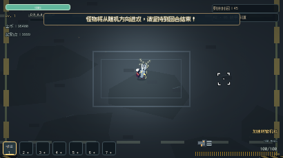
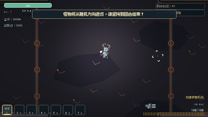
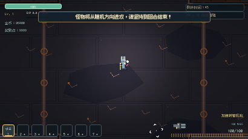
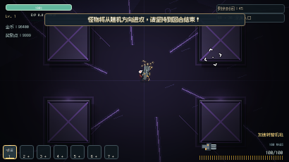
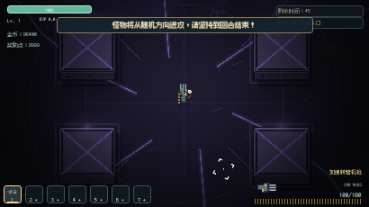
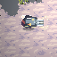
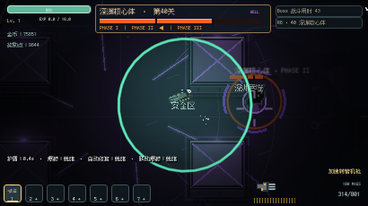
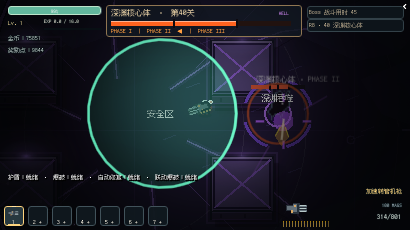
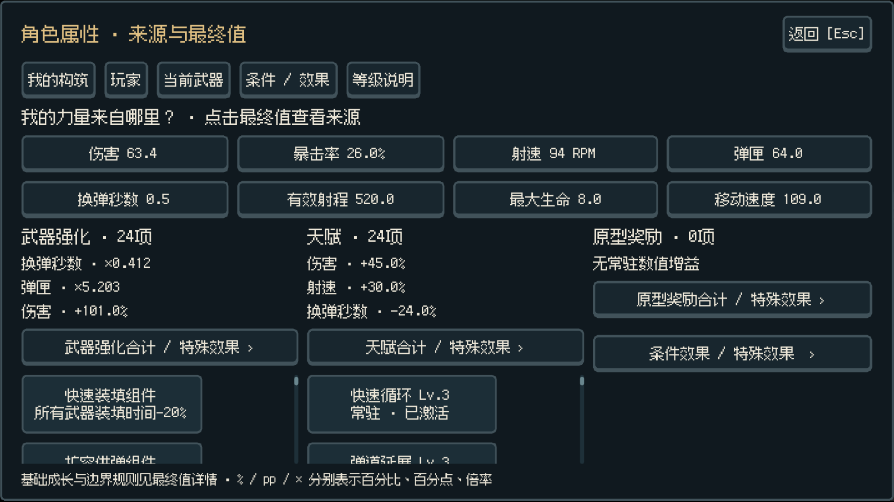
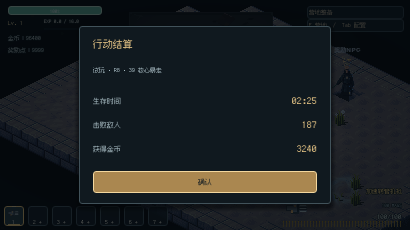

# Performance + Presentation Deep Pass

基线：`a8e5daf46a1333876aaa7aadcf04857101209957`，接手时已与远端 `main` 核对。分支：`codex/performance-presentation-deep-pass`。最终本地提交与交付二进制 SHA-256 见 ZIP 中的 `manifest.json`；本轮没有推送或发布远端版本。

## 结论

这次保留了有实测价值的静态地图合批、阴影/伤害数字分层，并把视觉预算转向墙体体积、地面结构、武器机械部件和有方向的攻击反馈。正常刷新率 Web D 的平均绘制提交从 **816.9 降至 521.0（−36.2%）**，敌人峰值均为 180。Web P 高压稳态解除刷新率限制后，平均帧间隔 **5.61 → 4.01 ms（−28.5%）**、p99 **18.16 → 15.16 ms**；原生项目 P 的 p99 **12.68 → 10.24 ms**。

**不能宣称所有场景都更流畅或三端全绿。** 正常 60 Hz Web 的尾帧总体持平；uncapped Web D 一轮退步、一轮改善，尚无稳定收益结论；Windows D 有一次 72.12 ms 尾帧。高负载退出后的旧 ObjectDB 错误也仍未解决，下文保留全部证据与失败状态。

## 实际修改与取舍

- **静态地图提交成本。** 原实现的 `_draw()` 也不是每帧重建；问题在于保存下来的不同 Canvas primitive 命令每帧仍需提交。`ArenaMesh.gd` 把有序、有颜色的图元合成一个 ArrayMesh surface，`CombatArena.gd` 在入场时构建、绘制时提交该 mesh。世界坐标、绘制顺序、普通 Canvas 灯光均保留，不使用低分辨率烘焙贴图。受控 180 角色消融场景的提交数为 606 → 阴影分层 426 → 再加地图 mesh 260；该场景用于定位，不冒充完整战斗的 FPS 结果。
- **阴影与数字。** `Monster2.tscn` 把接触阴影放在角色和预警下方；`HitLabel.gd` 使用绝对 z=8 的反馈层，减少字体与角色纹理交错。数字继续归原目标所有，父节点销毁时一并释放；没有靠少显示敌人或降低伤害信息数量获利。
- **区域材质与形体。** `RegionTheme.gd` 增加工厂板缝/铆钉/排水格栅、核心区域的环形嵌线、侵蚀区铺装；墙体有可读的顶面、前立面、收边与接触阴影。前立面收在原碰撞轮廓内。营地及 7 个战斗区域均完成渲染检查；碰撞、导航网格、出生点和区域机制未改。
- **武器身份。** `WeaponIdle.gd` 将通用绕枪光点改为贴合枪身的线圈、充能导轨、散热鳍片、弹仓、供弹结构和约束环。轨道枪电容读取真实蓄力，转管运动仍读取真实转速。原武器本体、稀有度体系、24 把武器的数值和握持语义保留。
- **攻击的时间与方向。** `CombatTelegraph.gd` 的临近触发闪烁改为连续推进的亮度；激光端点沿真实终点收束。`HostileVFX.gd` 的射击源使用有方向的短促火舌与两条射线，取消同时叠加的爆炸环；爆炸扩张改为快速起势、逐渐收尾。伤害边界、预警/激活时间和效果寿命不变。
- **加载与 UI。** `Boot.gd` / `web/loader.html` 共用像素字标、暖金分隔线、深色底和对应的布局比例。Web 内联现有 2070-byte 字标，避免为主要标识新增请求；跳过不可见的第二套原生加载 UI。真实进度、失败重试、完成握手和输入恢复逻辑保留，没有最低等待时长。`CampPanel.gd` 补齐属性名称与单位的中文表达。已有菜单、商店、天赋、设置、HUD、Boss HUD、奖励、死亡、结算界面经审计与试玩保留，没有为了文件数量重做它们。

## 测量方法与边界

机器：Windows 11 Enterprise 22631，Ryzen 7 9700X（8C/16T），约 32 GB RAM，RX 7900 XT。Godot **4.7.2.stable.official.ed1daf0bf**。浏览器 **Chromium 153.0.8010.12 / ANGLE D3D11 硬件渲染**；原生项目及 Windows release 使用同机 Vulkan Forward+。这里的 native 指 Windows 上直接运行 Godot 项目，不代表额外验证了 Linux/macOS。

基线导出和源码快照保持不变；最终测量使用 `final-web` / `final-windows` 构建。默认 1536×864，seed=20260918。D 为 stage 39 密集战斗，35 s，180 敌人峰值；P 为原有移动射击/击杀/补充的 180 目标压力夹具，计满 25 s 稳态。压力脚本的角色朝向序列也固定，未改敌人数、攻击密度、数值或玩法复杂度。Web D/P 正常刷新率各两组，Web uncapped D 和 Windows D 加入倒序复测；其余为表中完整窗口。测试窗口内没有其他游戏、导出、截图或压缩作业。

数据是 **Godot monotonic process-frame interval**，不是 GPU present timestamp。`process/physics` monitor 是引擎窗口峰值，不能伪称逐帧 CPU 时间；GPU 时间未测得。uncapped 同时解除浏览器和引擎刷新率限制，只表示工作余量，不是玩家显示器上的 FPS。节点、draw、物理/处理窗口峰值、首次入场、逐帧数组和 scoped timings 随完整 ZIP 提供。

多次运行的主表取 **每次分位数的均值、所有运行中最差的 max、累计 hitch 数**，不是合并样本的分位数。优先使用首次计划运行，不按结果好坏选择重试；原生 P 唯一因暂停/超时不完整的计划窗口改用第一次完整重跑。确认发生在 `[stress] done` 之后的 ObjectDB 错误只影响退出验收：其完整计时窗口仍保留并标明失败。其他中断/超时/暂停窗口不参与性能对照。

## BEFORE → AFTER

| 场景 | p95 ms | p99 ms | max ms | >25 / >33 / >50 ms 帧数 |
|---|---:|---:|---:|---|
| Web 60 Hz · D / 35 s | 18.89 → 18.89 | 21.08 → 20.85 | 43.17 → 44.76 | 8 / 5 / 0 → 6 / 4 / 0 |
| Web 60 Hz · P / 稳态 25 s | 19.60 → 19.62 | 20.89 → 21.17 | 25.50 → 27.60 | 1 / 0 / 0 → 3 / 0 / 0 |
| Web uncapped · D / 35 s | 10.11 → 11.43 | 12.04 → 15.11 | 40.94 → 40.79 | 5 / 2 / 0 → 16 / 5 / 0 |
| Web uncapped · P / 稳态 25 s | 13.41 → 11.18 | 18.16 → 15.16 | 25.94 → 20.72 | 1 / 0 / 0 → 0 / 0 / 0 |
| Windows release · D / 35 s | 6.92 → 6.62 | 8.00 → 7.57 | 22.63 → 72.12 | 0 / 0 / 0 → 1 / 1 / 1 |
| Windows release · P / 稳态 25 s | 6.97 → 6.68 | 8.74 → 8.43 | 12.34 → 14.81 | 0 / 0 / 0 → 0 / 0 / 0 |
| Godot native · D / 35 s | 8.07 → 7.43 | 9.26 → 8.47 | 34.15 → 33.26 | 2 / 1 / 0 → 2 / 1 / 0 |
| Godot native · P / 稳态 25 s | 9.87 → 8.02 | 12.68 → 10.24 | 26.16 → 16.69 | 1 / 0 / 0 → 0 / 0 / 0 |
| Web 4K 60 Hz · D / 20 s | 19.61 → 19.40 | 22.60 → 22.11 | 78.13 → 73.36 | 6 / 2 / 1 → 4 / 2 / 1 |
| Web Boss 40 · 完整三阶段 | 18.20 → 18.08 | 18.91 → 19.05 | 35.14 → 34.09 | 2 / 1 / 0 → 2 / 1 / 0 |

- Web uncapped D 倒序复测：首组 p99 **11.65 → 18.73 ms**，第二组 **12.43 → 11.49 ms**。这种波动不能用后一组覆盖前一组；没有形成稳定尾帧收益结论。
- Windows D 第二次 max 为 **22.56 → 22.71 ms**，第一次 AFTER 的 **72.12 ms** 仍是主表 max，未删除。该帧在开战后约 0.743 s，具体触发原因未证实。
- 4K AFTER 三次完整窗口 max 为 **73.36 / 78.32 / 69.88 ms**；三次都在采样结束后触发 ObjectDB 错误，因此 **4K 压测的退出验收失败**。普通 4K UI tour 是独立通过的功能测试。
- mesh 的一次性构建有代价：首轮 Web D 入场 **53.48 → 59.58 ms**，原生 **93.03 → 100.60 ms**，Windows **27.04 → 29.96 ms**。这是约 3–8 ms 的入场成本，换取持续提交减少；没有宣称加载全程均加快。
- 原生 P 的进程 RSS 峰值约 **528.9 → 531.9 MiB**；Windows P **496.7 → 489.3 MiB**。没有证据支持显著内存优化。
- 实际密集/移动射击负载仍有约 800–1100 个节点/秒的创建。Web D 首组的路径查询 **766.4 → 767.9 次/秒**，累计敌人移动作用域 **6.315 → 6.171 s / 35 s**，敌人数峰值 **180 → 180**；提交减少没有靠降低工作负载换取。碰撞/移动仍是主要采样热点，没有为更漂亮的数字改动物理行为、池化攻击实体或缩减弹幕。

## 首次使用与加载

真实鼠标/键盘、新浏览器与新存储下，基线 Boom Boi 首发与 dash 为约 16.67 ms，基线额外 trace 运行首发有一次 33.33 ms。本轮中间版本曾出现 133–183 ms 首发卡顿：ANGLE trace 捕获到 109–123 ms program 等待，实际 shader 源证明外观变更把一种 lit primitive/attribute 变体推迟到了首发。

最终发射器的真实金属边框/嵌线保留两种 Canvas 绘制路径，使它们在装备展示时已被使用。最终两次新浏览器复测，首发、二发、三发、首次 dash 的 **max 均约 16.67 ms，long task=0**。没有恢复多余环绕粒子，没有修改武器射击逻辑。该证据是 fresh browser/storage，不声称清空了系统 GPU 驱动缓存。

原生 Boot 五个阶段、Web shell/progress/menu 的真实帧均已捕获。Web loader 截图使用网络限速观察真实进度，**不用于启动速度结论**。正常 smoke 验证完成握手后可直接开始、出发、切换武器与射击，没有第二次启动提示。

## 验证状态

当前已完成 **65 个成功退出、无断言/脚本错误的验证条目 / 3902 条 PASS 断言**（包含针对最后一次修改的重复检查；不将其冒充独立功能数量；资源退出警告另列）。预定长流程与 CI 场景均已执行完毕；逐项结果见 summary.json 和 ZIP 日志。

当前回归失败项：无。历史冻结证据失败项：B12Strength, B13Strength；这两类分开报告，绝不把历史失败改写成通过。

- 新增 `tests/DeepPresentation.gd/.tscn`：34 项检查覆盖 mesh 世界坐标/索引/alpha、7 个区域的确定性、全局 RNG 不变、有效三角形/单 surface、阴影层和父对象清理。加入现有 native CI 的 contracts 阶段。
- 武器、天赋、伤害/激光边界、Spawn/导航、存档、经济、装备、暂停/输入、生命周期、RNG 契约已实际运行。最后的武器边框修改后重跑了 34 项新检查、8 项 RNG、55 项表现契约及全武器渲染。
- 24 武器 × 8 方向、8 个区域、敌人角色/精英、弹药状态、技能和警告/激活边界使用真实 Godot framebuffer。奖励、死亡、结算的补充截图明确为配置场景，不声称是正常难度下自然获得的奖励/成绩。
- **最终交付的同一 Web 包**通过 1536×864 与 3840×2160 各 15 状态的 Web tour、启动 smoke、真实购买/装备/换槽、3 轮菜单返回/暂停/设置/输入与存档恢复测试。最终 cold test 另用真实输入验证出发、射击、重装和 dash。
- 原生四场 Boss 的完整渲染观测 **158 项检查通过**，真实武器射击结束战斗、三阶段/终极技能/清理均有记录。该测试使用原有 **400 HP 耐久观察夹具**，不冒充 8 HP 原始难度通关；Web Boss 计时使用显式阶段观察夹具，同样不冒充自然通关。
- 基础构筑 M6 的 30 关自动驾驶记录为 **8 生还、22 死亡**；M8 记录为 **27 个普通关生还，3 个 Boss 关死亡**。两者各 60 项进入/清理检查通过；这不是全部关卡胜利的声明。M10 的 full 构筑三场 Boss 另行实跑，stage 10 / 20 通关、stage 30 阵亡，24 项机制检查通过。机器人胜负、伤害、移动量和完整日志均保留，未为了通关修改原始血量或伤害。
- headless B5 四 Boss 回归另有 **166 项检查通过**，400 HP 观察组四场均一次真实射击清场；其独立原始 8 HP 最终 Boss 尝试在 **7.664 s 阵亡**。这些是自动驾驶观察结果，不是人的游玩胜率评估。
- 本地执行，不声称远端 GitHub Actions 或线上 Pages 已验证。本轮未推送、未部署。

## 未解决的问题

1. **高负载退出后偶发引擎 ObjectDB 错误**：`Condition "slot >= slot_max" ... get_instance`。原始 main 也已复现；位置在完整采样结束、主菜单重建之后。启用脚本栈并接入 [Godot Logger](https://docs.godotengine.org/en/stable/classes/class_logger.html) 的专用诊断构建捕获到错误，但 ScriptBacktrace 为空，未定位到可安全修复的脚本调用。该问题仍计为退出失败，不能称三端完全稳定；不以延迟退出或忽略 console error 掩盖它。
2. **尾帧改善不全面**：60 Hz Web 基本持平、uncapped D 波动，以及 Windows D 的 72.12 ms 尾帧如上。4K 仍有约 70–78 ms 的最大帧，未消除所有首次/切换成本。
3. **部分测试退出仍报告资源/RID/ObjectDB 未释放警告**。例如未修改基线的 M3Weapons 同样有 4 ObjectDB / 2 resources-at-exit；最终生命周期契约通过不等于所有引擎退出警告消失。全部日志保留。
4. UI tour 的 `shop-owned` 步骤仍有约 0.6 s 的单帧停顿，原始基线也有约 0.58 s。源码确认该步骤在一个调用中购买全部武器、配件及全部天赋等级，属于批量配置夹具；它不代表单次真实购买的耗时。导览中的首次战斗/Boss 切换仍观察到约 0.1–0.15 s 的尾帧。截图流程和并行 CI 下的这些数值只记为线索，没有拿来声称配对性能改善，也没有宣称消除了所有首次使用成本。
5. **B12Strength / B13Strength 的 B17 历史冻结证据审计失败**。现有 CI 已把它们定义为手动选择的 informational / continue-on-error 历史任务；其主要失败是旧源码指纹，另有武器 113 的 late horde 冻结记录低于原门槛。未修改 main 的两项实跑失败标签与 AFTER 完全相同，均已保留日志。没有改写冻结数据、重设指纹或放宽强度门槛来制造绿灯。
6. 仅在这台 Windows/RX 7900 XT 机器上完成验证；未验证集显、移动 Web、macOS/Linux。自动化实机与截图检查不等于人的审美/手感接受；音效主观听感未评分。

## 视觉对照

| BEFORE | AFTER |
|---|---|
|  |  |
|  |  |
|  |  |
|  |  |
|  |  |
|  |  |

| Boss 终极技能预警 | Boss 终极技能激活 |
|---|---|
|  |  |

## 完整运行索引

原始逐帧数组、压力构建/稳定阶段、scope counters、进程 RSS、GPU/构建身份、console 和失败重试在 ZIP 的 `Evidence/` 中。以下也包含退出失败但计时完整的运行；所有数据均可追溯至 `summary.json`。

| 运行 | p95 / p99 / max ms | 平均 draw | 退出验证 |
|---|---:|---:|---|
| after-native-D-1 | 7.43 / 8.47 / 33.26 | 550.4 | 通过 |
| before-native-D-1 | 8.07 / 9.26 / 34.15 | 785.1 | 通过 |
| after-native-P-1-attempt2 | 8.02 / 10.24 / 16.69 | 360.6 | 通过 |
| before-native-P-1 | 9.87 / 12.68 / 26.16 | 524.4 | 通过 |
| presentation-after-normal-A-1 | 18.08 / 19.05 / 34.09 | 311.8 | 通过 |
| presentation-before-normal-A-1 | 18.20 / 18.91 / 35.14 | 476.9 | 通过 |
| after-4k-D-1 | 19.40 / 22.11 / 73.36 | 512.2 | 失败：采样后 ObjectDB 错误 |
| after-4k-D-1-attempt2 | 19.63 / 22.21 / 78.32 | 521.5 | 失败：采样后 ObjectDB 错误 |
| after-4k-D-1-attempt3 | 18.57 / 21.29 / 69.88 | 534.1 | 失败：采样后 ObjectDB 错误 |
| after-normal-D-1 | 18.74 / 20.43 / 43.25 | 520.4 | 失败：采样后 ObjectDB 错误 |
| after-normal-D-1-attempt2 | 18.65 / 20.56 / 42.04 | 528.6 | 失败：采样后 ObjectDB 错误 |
| after-normal-D-1-attempt3 | 18.75 / 20.90 / 41.63 | 528.7 | 通过 |
| after-normal-D-2 | 19.03 / 21.27 / 44.76 | 521.5 | 通过 |
| after-uncapped-D-1 | 13.62 / 18.73 / 39.99 | 508.5 | 通过 |
| after-uncapped-D-2 | 9.23 / 11.49 / 40.79 | 501.3 | 失败：采样后 ObjectDB 错误 |
| before-4k-D-1 | 19.61 / 22.60 / 78.13 | 816.0 | 通过 |
| before-normal-D-1 | 18.75 / 20.50 / 43.00 | 826.9 | 通过 |
| before-normal-D-2 | 19.03 / 21.66 / 43.17 | 807.0 | 通过 |
| before-uncapped-D-1 | 9.85 / 11.65 / 40.74 | 783.5 | 通过 |
| before-uncapped-D-2 | 10.36 / 12.43 / 40.94 | 787.8 | 失败：采样后 ObjectDB 错误 |
| after-normal-P-1 | 19.64 / 21.17 / 27.60 | 354.7 | 通过 |
| after-normal-P-2 | 19.60 / 21.17 / 26.62 | 355.7 | 失败：采样后 ObjectDB 错误 |
| after-normal-P-2-attempt2 | 19.80 / 21.34 / 40.59 | 332.4 | 通过 |
| after-uncapped-P-1 | 11.18 / 15.16 / 20.72 | 343.8 | 通过 |
| before-normal-P-1 | 19.58 / 20.89 / 24.17 | 557.8 | 通过 |
| before-normal-P-2 | 19.62 / 20.90 / 25.50 | 559.5 | 失败：采样后 ObjectDB 错误 |
| before-normal-P-2-attempt2 | 19.69 / 20.85 / 23.52 | 553.2 | 通过 |
| before-uncapped-P-1 | 13.41 / 18.16 / 25.94 | 537.1 | 失败：采样后 ObjectDB 错误 |
| before-uncapped-P-1-attempt2 | 13.36 / 17.75 / 43.74 | 540.8 | 通过 |
| after-windows-D-1 | 6.88 / 7.97 / 72.12 | 510.6 | 通过 |
| after-windows-D-2 | 6.35 / 7.18 / 22.71 | 528.4 | 通过 |
| before-windows-D-1 | 7.00 / 7.83 / 22.63 | 782.6 | 通过 |
| before-windows-D-2 | 6.84 / 8.16 / 22.56 | 799.0 | 通过 |
| after-windows-P-1 | 6.68 / 8.43 / 14.81 | 325.1 | 通过 |
| before-windows-P-1 | 6.97 / 8.74 / 12.34 | 542.9 | 通过 |

复现工具：`tools/web-b11-1-stress.js`、`tools/b192-run.py`、`tools/web-first-shot.js` 和 ZIP 中的本轮编排脚本。Web uncapped 需同时设置 `B11_UNCAPPED_BROWSER=1` 并传 `benchmark=uncapped`；默认浏览器行为未变。性能窗口与截图/录屏、压缩、导出分开运行。
