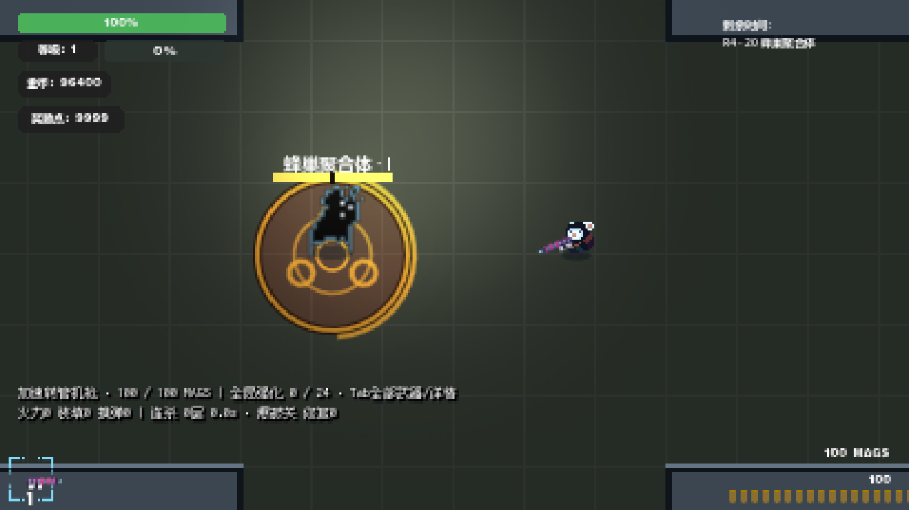
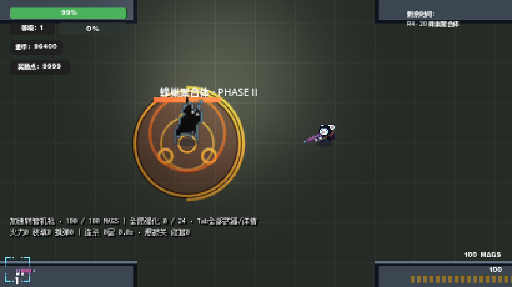

# M8-R1 云端复审整改

**M8-R1 REVIEW FIXES COMPLETE / READY FOR THIRD HUMAN REVIEW**

`HUMAN_ACCEPTED=false`。起点 `feat/towdown-experience-upgrade@c8e168e`。仅补齐 brood 预警、收敛 CombatTelegraph 开销与修正性能报告；内容仍为 24 枪 / 24 强化 / 24 天赋 / 12 普通敌人 / 3 Boss / 6 区 / 30 遭遇。未进入 M9，等待第三次真人试玩。

## 预警与生命周期

B02 brood 现在创建 owner/epoch 绑定的 `summon` HostileZone：统一橙红填充、深色对比边界、收缩圈、倒计时和三个孵化芽标记。第一阶段半径 34，第二阶段 42；它表示 Boss 即将召唤，不表示精确落点，也不造成伤害。召唤数量、位置选择、上限、0.65/0.5 秒 warn 与原有恢复时间均未改变。

逐项检查 B01 charge/cleave/slam、B02 brood/lockdown/pulse、B03 dash/sweep/burst；brood 是唯一遗漏。18 项攻击×阶段合同检查真实存活的 HostileZone、warn 中的可见性和无提前命中，原生渲染消费了实际几何，并检查攻击结束清理。另测 brood 死亡、转阶段、回营、epoch 更换；动态墙、移动起点、激活与扫射更新；60 个预警下的视觉预算及全部到时清理。强制选择攻击/阶段仅用于这些合同与截图，不用于 Boss TTK。

## Profile → 低风险优化

20 秒同一 60-zone 压力场景的插桩诊断（包括预热；CPU 累计不等于整帧时间）：

| 测量 | 绘制调用 | 绘制 CPU 累计 ms | raycast 次数 | 物理 CPU 累计 ms |
|---|---:|---:|---:|---:|
| r1-profile-before | 66247 | 2722.50 | 22531 | 155.07 |
| r1-profile-after | 47053 | 1602.33 | 8738 | 125.71 |
| r1-profile-final | 47170 | 1224.87 | 8708 | 124.23 |

先缓存稳定的 cone、line、circle 和 sweep sector 几何，并按半径/弧长选择 12–64 段，避免小环固定 48/64 段。束线边界、冲锋箭头和中心短线批量绘制。静止 warn 的墙查询每 0.1 秒刷新；起点移动立即刷新，实际攻击/扫射仍每 physics tick 查询。warn 装饰 30Hz 更新，末段 150ms、激活边缘及攻击仍保持物理频率；伤害、warning/duration/tick 均未缩短。

超过 32 个 HostileZone 时只省去冗余中心光环，召唤图案和所有范围、边界、倒计时、方向提示保留；60 个危险实体没有裁减。没有采用按距离/屏外完全停刷：长束线可能从屏外进入视野，新增错误裁剪风险不值得；引擎仍负责正常视口裁剪。本轮没有改 VFX 上限、攻击、并发数量或玩法压力。

## 性能原始数字与判定

新规则：p95 或 p99 **绝对增加 >8ms，或相对增加 >20% 且绝对增加 >2ms**，任一即 `review_needed=true`。2ms 是小基数噪声门槛；+11ms/+30% 不会被 35% 阈值吞掉。六项 Python 回归覆盖历史例子、绝对/相对单独越界、噪声、改善及仅 p95 越界。

历史 M7/M8 数字不替换：

| 批次 / 版本 | p50 ms | p95 ms | p99 ms | max ms |
|---|---:|---:|---:|---:|
| 历史 / M7 | 34.985 | 37.453 | 38.666 | 40.078 |
| 历史 / M8 | 45.294 | 48.543 | 50.459 | 53.340 |
| R1 同批隔离 / M7 | 6.899 | 9.549 | 10.858 | 12.796 |
| R1 同批隔离 / M8 | 5.473 | 12.540 | 14.170 | 18.284 |
| R1 同批隔离 / M8-R1 | 6.897 | 11.230 | 12.596 | 15.754 |

历史 telegraph 现在明确 `review_needed=true`。最终使用游戏 SubViewport 的 CANVAS draw-call 计数，并保留 global_draw_calls / viewport_draw_calls；完全失焦最小化会抑制自动绘制；最终每个 process frame 调用一次 RenderingServer.force_draw(false)，显式渲染同一游戏视口而不显示/激活桌面窗口。三版本使用同样调用。首次计数探针调用缺少 Godot 4.7 的类型参数，失败日志保留；随后改为 CANVAS 并要求实际绘制 >0；在零绘制样本被门槛拒绝后，增加上述逐帧离屏绘制。performance-r1-isolated.json 与 performance-r1-verified.json 的零绘制批次均不用于最终结论。当前成对中位数通过新门槛；这只是本机 GL 后台工程信号，不是跨硬件保证。原始每次测量、draw calls、60-zone target/peak、补充实体计数、输入隔离与源码哈希都保留在 `performance-r1-offscreen.json` 及对应 execution 文件。

按 M7 → M8(c8e168e) → M8-R1 → M8-R1 → M8 → M7 顺序，每次 20 秒、前 3 秒预热，固定 seed 808、同一 60-telegraph 补充规则、24 个敌人输入、1366×768/410×230 视口、GL 渲染器。两版 AI 的随机数消耗不同，单次实体位置与补充计数可能不同；没有缩小 R1 并发或压力。当前桌面调度环境与历史批次不同，所以不把历史 50ms 与当前 10ms 跨批相减作为优化收益。

用户指出早期最小化游戏窗口仍捕获鼠标。已停止该轮，保留部分 `performance-r1-final.json`，不算最终对照。后续使用工作区 archive 中的渲染隔离副本：仅改副本的鼠标捕获赋值为 VISIBLE、禁止旧测试 warp_mouse；窗口 unfocusable + mouse_passthrough，并以 SW_SHOWMINNOACTIVE 启动。原始游戏源码鼠标逻辑没有改。三个版本应用同样隔离，记录每个变换文件前后哈希及 canonical_source。最终 performance 数据必须通过鼠标可见/不取焦点检查；测试 fixture 使用内部移动/瞄准输入，不发送桌面键鼠。

## M8 关键回归与三档 Boss

保留 M8 关键回归 21 个进程、921 项检查通过。包括危险区命中、Boss 停止/死亡/回营、武器/机制/天赋、UI、补给、退出钱包与存档恢复；沿用已识别 MP3 退出引用分类，其他错误不豁免。见 r1-regression/index.json。

| 档位 | Boss 关 | TTK 秒 | 入伤 | 实际观察到的 warn |
|---|---:|---:|---:|---|
| middle | 10 | 73.74 | 3.88 | charge, cleave, slam |
| middle | 20 | 119.31 | 2.91 | brood, lockdown, pulse |
| middle | 30 | 105.11 | 4.85 | burst, dash, sweep |
| high | 10 | 40.83 | 0.97 | charge, cleave, slam |
| high | 20 | 66.84 | 2.91 | brood, lockdown, pulse |
| high | 30 | 62.30 | 3.88 | burst, dash, sweep |
| full | 10 | 35.71 | 0.00 | charge, cleave, slam |
| full | 20 | 55.19 | 1.94 | brood, lockdown, pulse |
| full | 30 | 48.22 | 0.00 | burst, dash, sweep |

九场正常生命、真实武器/射弹/射线和移动输入实战全部完成、两阶段到达、三个核心攻击执行，额外采样 warn 期间的实际 owner-bound 节点，不能仅凭 action counter 通过。完整配置仍满足原 30–50 / 40–60 / 45–75 秒预算。未给机器人无敌、传送或强制输出。

中档首轮第 30 关机器人死亡（67.878 秒、入伤 8.73），此前 10/20 两场通过；失败与固定 MP3 退出引用原样保留。按现有 only30 单关入口独立复测，最终表的中档第 30 关取该次结果，不把失败抹去，也没有因机器人死亡调整任何产品参数。

完整配置首轮第 20 关通关为 60.681 秒，略超原 60 秒上限；按现有 only20 入口独立复测，最终表保留该次结果。首场超时长样本仍在 r1-bosses-full.txt 和摘要的复测原因列表，不声称机器人每次实战都稳定落在预算内；这项波动也交给真人复审。其余两场取原整组结果。

原生图片实际检查了 brood 两阶段、charge、cone、circle、sweep，以及 60-zone 预算画面；可读性和鼠标隔离的自动证据不替代真人手感/音效验收。首次原生合同 94 项，追加压力预算后 98 项；最终隔离重跑以 r1-telegraphs-isolated.txt 为准，不重复累计。早期 r1-telegraphs-final 期间只改了另一份测试 M8Contracts，product_unchanged=true；最终渲染副本的运行期 source_unchanged 必须为 true。

复跑：`python tools/verify-m8-r1.py`；无其他游戏测试时 `python tools/benchmark-m8-r1.py --offscreen`；`python tools/run-m8.py r1-telegraphs-isolated M8R1Telegraphs --render`；`python tools/test-performance-rule.py`；`python tools/report-m8-r1.py` 与 `python tools/report-m8.py`。

停止于本状态，等待第三次真人试玩；不 merge main，不 Release，不进入 M9。真人重点：Boss 20 两阶段召唤前是否一眼可辨，密集预警中是否仍能读清边界与方向。

发布的新增终端日志仅规范化行末空白与重复空白尾行；原始字节留在 archive/workspace-support/m8-r1-raw-terminal-logs，原始/发布 SHA256 见 r1-text-normalization.json。错误、失败和原始测量数值均保留。
