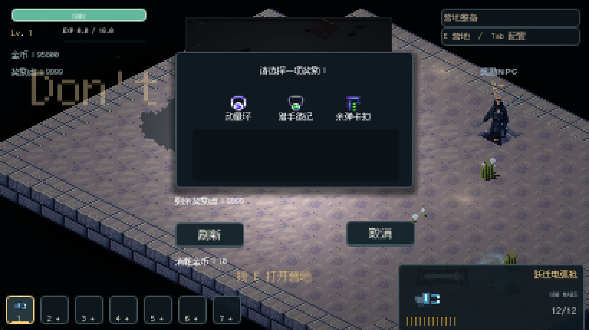
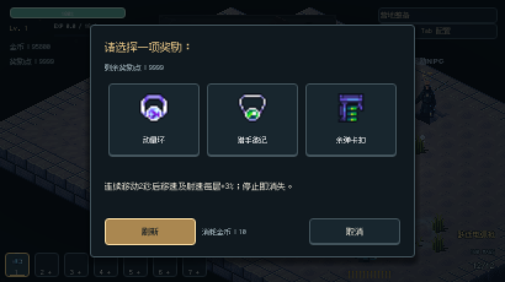
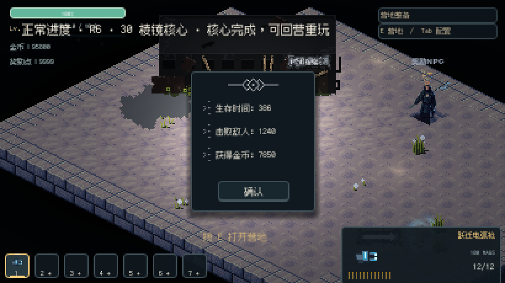
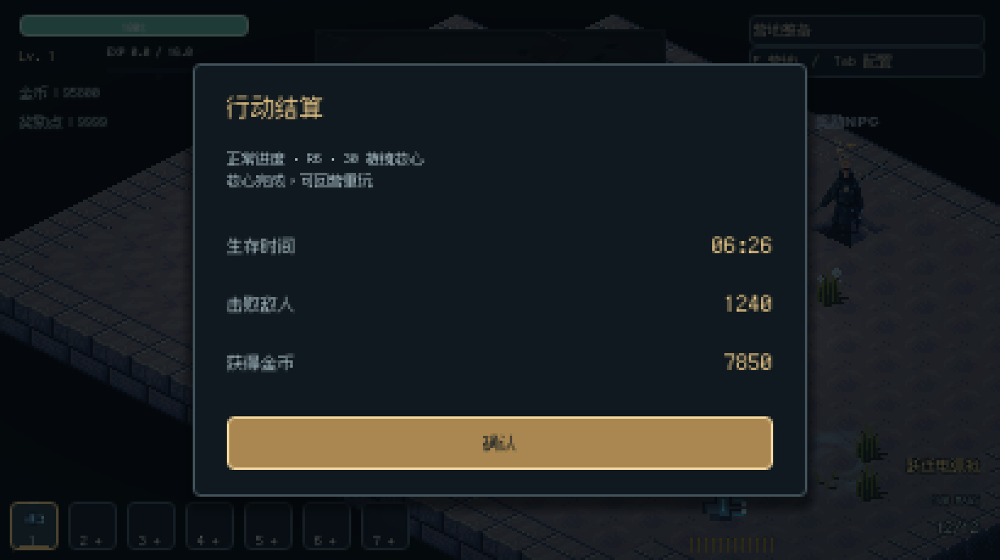
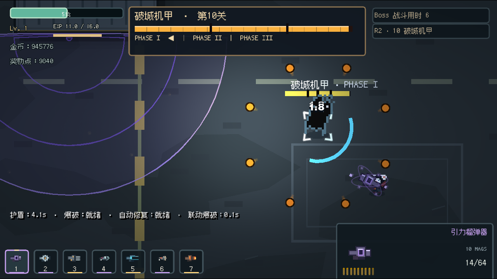
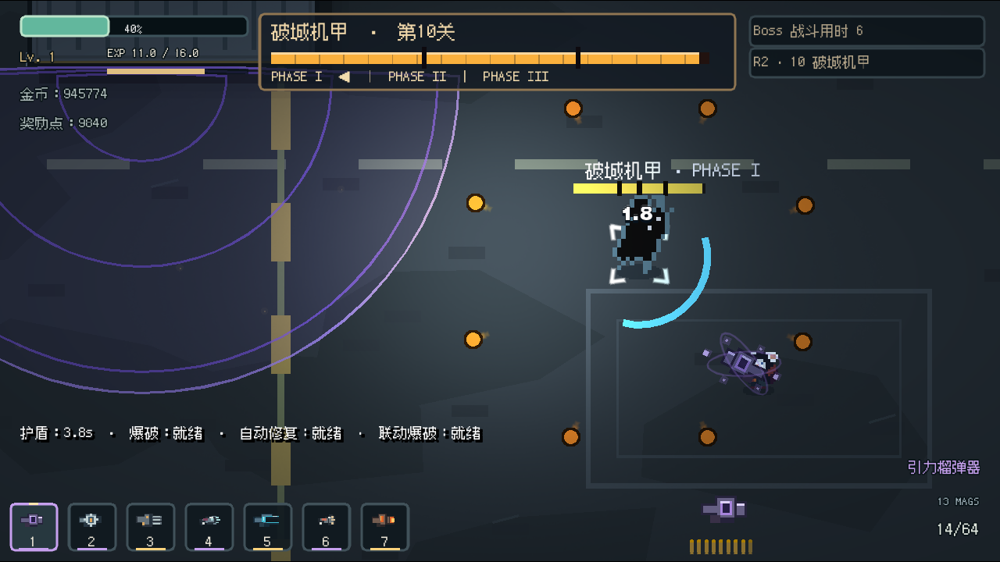

# Final Visual Polish

基线：`codex/visual-gilding` / `7b42322`。先运行基线、记录浏览器完整页面巡检与真实鼠标键盘试玩，再修改表现层并复玩。保留现有视觉方向、玩法、武器数值、敌人行为、地图碰撞与存档格式。

## 最值得修的落差

- 奖励选择的余额、刷新费用和按钮漂在主面板外，说明默认空白，奖励图标缺少完整的悬停与焦点表面。
- 复活和结算沿用窄小旧面板；结算的关卡说明位于屏幕左上，与战斗 HUD 混杂，统计信息缺少层级。
- 状态 HUD 已透底，弹药区仍是一大块深色底板；Boss 面板下方空余偏多，生命扣减缺少视觉连续性。
- 爆炸主要依赖大块绿色填色与均匀矩形碎屑；连续通知的旧淡出回调可能提前隐藏新消息。
- 导出规则遗漏本地 `output/`，把取证图片等开发输出带进了试玩包。

## 完成的精修

奖励、复活和结算统一为居中完整面板、暖金主操作与柔和暗幕。奖励图标放大为完整卡片，键盘焦点和鼠标悬停展示相同说明；描述、余额、费用与按钮都位于面板内。结算改为清楚的标签 / 右对齐数值，时间使用分秒格式，关卡信息归入面板。

弹药区跟随透明 HUD，以描边保证文字辨识。Boss 面板由 41 缩至 32 逻辑像素高并降低背景不透明度；实色填充即时反映 HP，失血残影短暂停留后追上。持续射击不会反复把整个残影计时归零，新 Boss 与回血会重置残影。

爆炸改为快速压力波、短暂亮芯与稀疏暖色碎屑，降低大块填色。绘制沿用真实墙体裁剪轮廓，保留伤害边界、240 ms 生命周期、装饰预算、降低闪光设置与原有 RNG 序列。通知过渡可取消，旧消息不能关闭新消息。

Web / Windows 导出都排除 `output/*`。PCK 从基线试玩包的 56,817,616 字节降至 41,437,936 字节（约减小 27%）。直接挂载最终 PCK 确认开发输出不存在、主场景及 HUD 资源存在。

## 验证

| 检查 | 结果 |
| --- | --- |
| FinalPolish 专项：刷新费用、复活防重复、结果回调、暂停、24 项奖励描述布局、持续扣血残影、通知替换 | 50 / 50 |
| PresentationContracts | 55 / 55 |
| PresentationRng | 8 / 8 |
| PresentationLifecycle，10 次战斗 / 回营循环 | 52 / 52；无孤立节点与特效残留累积 |
| CampPresentation | 38 / 38 |
| 原生实射引力榴弹：产生爆炸、真实伤害、预算回收 | 4 / 4 |
| M9 原有校验器限定火箭炮 / 引力榴弹器，近距、中距、极限、超距、墙前、墙后 | 12 / 12 表现与命中一致 |
| Web 页面巡检：菜单、营地、商店、强化、天赋、属性、训练、射击、暂停、Boss | 1280×720 与 626×674 通过，无脚本 / 页面 / HTTP 错误 |
| Web 真实输入复玩 | 购买、强化、天赋各等级、四种窗口宽度、Stage 31 移动 / 射击与陨石完整时间线通过 |
| 原生奖励 / 复活 / 结算画面 | 宽屏与窄窗口确认；费用和按钮没有漂出面板 |
| Web / Windows Release 导出、最终 PCK 检查 | 通过 |
| 最终独立 Windows EXE，隔离 APPDATA | 营地、进入战斗、换枪、射击与退出通过 |
| Git 差异检查 | 通过 |

同 RX 7900 XT、Chromium ANGLE D3D11、1280×760、Stage 39，各 30 秒 / 30 个统计窗口：

| 指标 | `7b42322` | 最终包 |
| --- | ---: | ---: |
| 平均 FPS | 56.90 | 57.07 |
| 平均帧耗时 | 21.08 ms | 21.02 ms |
| 各窗口 P95 的均值 | 22.87 ms | 23.76 ms |
| 峰值敌人数 | 180 | 180 |

短测未见明显性能退化；不是所有硬件或长时间运行的保证。页面遍历和正常生命值战斗复玩不等于无伤通关全部 40 关，也不替代玩家对最终审美和手感的接受。

临时取证脚本首次存在日志目录缺失、独立包检查未设置主场景的问题；修正脚本后重新执行通过。最终游戏运行无对应错误。工程日志、录像、原生截图、性能明细与文件哈希位于本地忽略目录 `output/final-polish/`。

## 实机前后对照

奖励选择：

结算：

Boss 战与透明弹药 HUD（不同实时战斗帧）：

## 交付

- Windows：`build/final-polish-windows/Don't Stop.exe` 与同目录 PCK。
- 完整便携包：`build/Dont-Stop-Final-Visual-Polish-Windows.zip`，含 EXE、PCK 与操作说明。
- Web：`build/final-polish/index.html` 及同目录资源；本地试玩地址 `http://127.0.0.1:8765/final-polish/index.html`。
- 改动集中在 13 个表现层脚本 / 场景及导出规则，另含专项回归、设计约定与本报告；未推送、合并或发布远程版本。
