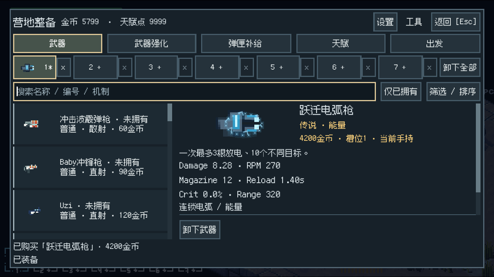
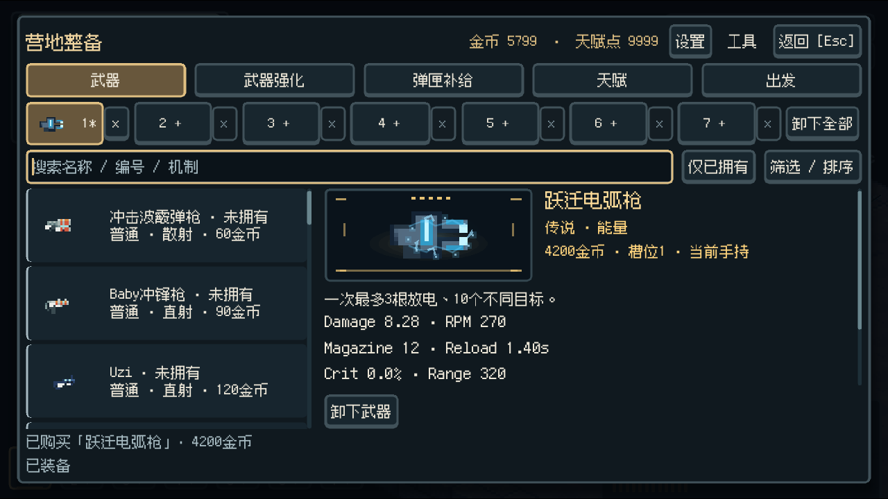
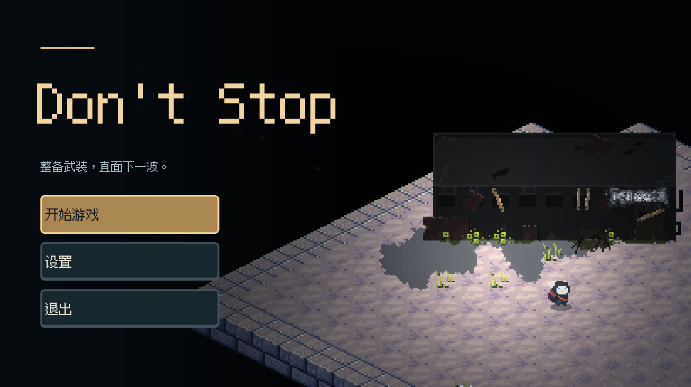
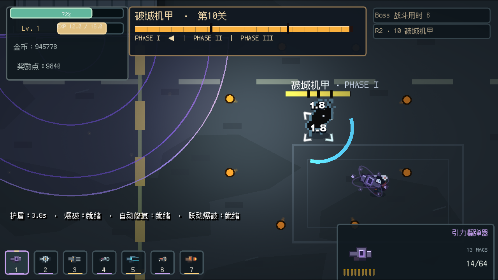

# 2026-09-28 视觉镀金迭代

## 基线与验收

- 唯一代码基线：GitHub `seiya058904/Dont-stop` 的 `main`，`f6d4750c009b892cbbfdfeb7398bf9ddea61cb7f`。开始时本地 HEAD、远端 main 一致，工作区干净。
- 修改前已导出该基线，实际进入营地、购买武器、出发并进行移动/射击；另通过原有真实输入脚本走完营地与第 31 关流程。
- 验收目标：主要可见界面具有统一材质与清晰层级；高品质武器具有机制相关的视觉身份；增强环境和战斗反馈；购买、装备、天赋、真实属性、射击、换弹及生命周期保持稳定。
- 实现在本地 `codex/visual-gilding`，未推送、合并或发布。

## 改动范围

| 区域 | 主要文件 | 结果 |
| --- | --- | --- |
| 统一样式 | `ui/GildedTheme.gd`、`ui/CampPanel.gd`、`ui/StatPanel.gd`、`ui/DemoSettings.gd`、`ui/BuildIcon.gd` | 暖金强调、金属层次、聚焦/禁用/主要操作状态，统一陈列与信息层级 |
| 菜单与加载 | `ui/MainUI.gd`、`boot/Boot.gd`、`web/loader.html`、`project.godot` | 非居中菜单构图、金色字标、顺滑入场与统一加载配色；隐藏原本无动作的模组按钮 |
| HUD / 结算 | `ui/GameUI.gd`、`ui/BossHUD.gd`、`ui/widgets/*`、`ui/ControlUI.gd` | 生命、弹药、七槽、Boss 阶段、提示及结算面板统一；修正数字贴边与右上信息覆盖 |
| 武器表现 | `ui/WeaponDisplay.gd`、`game/effects/WeaponIdle.gd`、`TierMuzzle.gd`、`game/guns/BaseGun.gd` | 展示底座、品质标识、导轨/电流/引力轨道等身份、短促亮芯、稳定回弹 |
| 命中表现 | `autoload/Combat.gd`、`game/effects/ImpactAccent.gd`、`CombatEffect.gd`、`ui/widgets/HitLabel.gd` | 实际扣血触发的受限碎光、能量亮芯、清晰的伤害数字 |
| 场景 | `ui/Atmosphere.gd`、`game/map/EnvironmentLights.gd`、`RegionTheme.gd`、`CombatArena.gd`、`mapTown/Town.gd` | 稀疏尘粒、局部呼吸反光、边缘氛围、墙体接触阴影；保持几何与预警 |

未修改武器数值、敌人配置、关卡规则、经济价格、存档格式、碰撞形状或地图导航。

## 检查记录

| 检查 | 结果 |
| --- | --- |
| Godot 4.7.2 导入、Web / Windows Release 导出 | 完成 |
| PresentationContracts | 55 项通过，包含新增的命中特效上限、随机数与释放检查 |
| CampPresentation | 38 项通过，包含搜索、空态、原始像素缩放、预览复用、属性不变 |
| PresentationRng | 8 项通过 |
| PresentationLifecycle | 52 项通过，10 轮战斗/营地往返，节点与孤立对象不持续累积 |
| BaselineRegression / B17Contracts / M3Weapons | 4 / 20 / 70 项通过 |
| B14Feedback | 6 项功能检查通过；直接退出时有背景音乐资源清理警告 |
| M9Presentation | 12 个报告案例全部 `consistent=true`；直接退出时同样有背景音乐资源清理警告 |
| PresentationBoundary（实际原生渲染） | 9 项通过；最初 headless 调用因该夹具要求渲染和输出目录退出 2，改用正确方式后通过 |
| 真实输入 Web 营地流程 | 购买、强化、天赋三次升级、四种窗口尺寸、正常第 31 关输入与陨石时间线通过 |
| Web 页面巡检 | 1280×720 与 626×674，菜单、营地、商店、强化、天赋、属性、练枪、战斗、暂停与 Boss |
| Windows Release smoke | 独立 APPDATA 测试目录，营地、换枪、射击与正常退出 |

工程证据保存在本地忽略目录 `output/gilded/`，其中 `final-tour/` 是最终页面截图，`final-input/` 是真实输入回归，`native-final/` 是 Windows 运行证据，`tests/` 保存原生检查日志。

首次整合时运行检查发现 `GameUI.gd` 的颜色推断解析错误，已修复。第一次 Windows 截图命令因参数引号导致路径前多出空格、无法写 PNG；运行 smoke 本身通过，随后以正确参数重跑并重新检查截图。上述失败日志保留在本地，不作为成功证据。

`B14Feedback` / `M9Presentation` 的退出警告经 verbose 定位为 `Cephalopod.ogg` 的播放资源；这些夹具直接调用树退出。没有把它们描述为零警告，也没有为本次视觉任务修改音频退出系统。

## 性能边界

同一 RX 7900 XT / Chromium ANGLE D3D11，1280×760，第 39 关，各 20 秒、20 组采样：

| 指标 | main 基线 | 升级版 |
| --- | ---: | ---: |
| 平均 FPS | 55.50 | 55.30 |
| 平均帧时（ms） | 23.37 | 23.30 |
| 各采样窗口 p95 的平均值（ms） | 26.01 | 27.01 |
| 峰值敌人数 | 180 | 180 |
| 峰值节点数 | 1982 | 1980 |

该短时对照未显示明显性能退化，不代表全部关卡、长时间游玩或低端 GPU 性能保证。初轮页面巡检使用的软件渲染数据不用于此性能结论。新增装饰有固定预算，不改变真实攻击轮廓。

加载页静态样式检查发现重试按钮文字对比度不足，已修正；原有进度条活动扫光被分类为循环动画，保留其“正在工作”的含义与 reduced-motion 分支。Godot 原生控件没有套用 HTML 检测结论。

## 试玩

- Windows：`build/gilded-windows/Don't Stop.exe`，同目录包含对应 PCK；这是独立可运行导出，不要求安装 Godot。
- Web：`build/gilded/index.html`，通过本地 HTTP 服务访问。
- 本轮没有做远端部署，也没有声称人工审美验收完成。

## 实际渲染对照

以下为运行截图，非概念图。

基线营地：

升级后营地与传说武器：

Windows 主菜单：

Web Boss 战斗：

