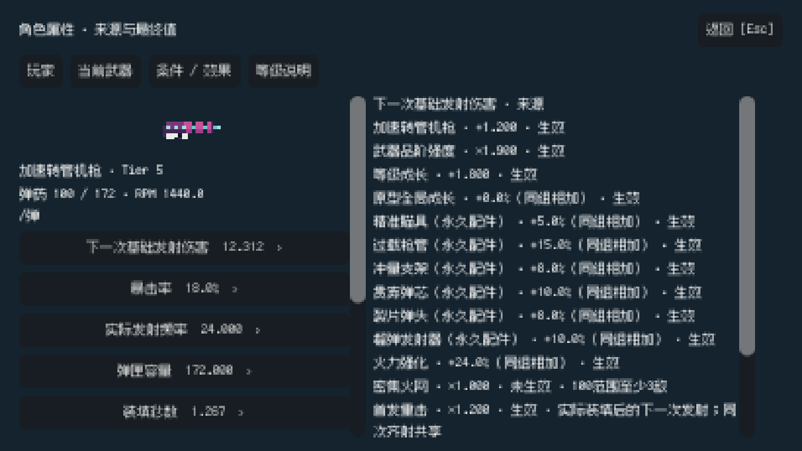
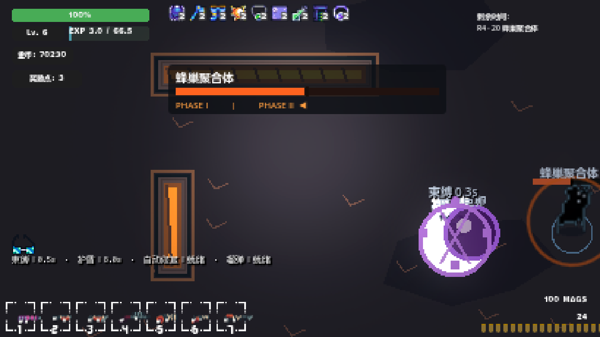

# M11 — Horde Pressure & Player Clarity

起点 `feat/towdown-experience-upgrade@928db1c`，接续第四轮真人反馈。最终机器门禁以 [summary.json](evidence/m11/summary.json) 为准；本报告区分自动化、原生运行、性能测量和仍待真人判断的事项。

产品提交 `abd93ec`，测试/工具提交 `cf8186e`；文档与全部原始证据独立收尾。最终源码 SHA256 与原生属性专项快照一致，8 项汇总门禁全部通过。

## 范围与结果

24 Guns / 24 Attachments / 24 Talents / 24 Rewards / 12 普通敌人 / 3 Boss / 6 Regions / 30 Encounters 保持。没有合并 main、Release 或进入 M12。原三个项目、用户 plan ZIP 和原有外层删除不属于本轮提交。

- 21–29 增加分批进入、重叠增援和合法多方向到场；27–29 的 E01/E02 到场速度增加 20%，存活上限分别 110/125/145。敌人 HP、Boss HP、武器品阶强度、奖励与天赋数值不变。
- Level 使用同一个公式模块驱动成长、HUD 通知和说明；采用最大生命 +0.5、当前生命仅 +0.5。
- 营地和暂停菜单均可打开角色属性；玩家/当前武器/条件效果/等级说明共用真实有效属性 API，能够展开来源。
- HUD 只保留有时效意义的状态；束缚有角色前景紫色锁链、文字、图标、倒计时及解除后的免控提示。新增可点击的“束缚教学”，使用正式 B02 巨卵碰撞触发。

## 固定合法构筑与测量方法

完整购买顺序、实际扣款、天赋等级、奖励层数、持有全局强化及保存内容见 [legal-builds.json](evidence/m11/legal-builds.json) 和 `tests/M11Builds.gd`。所有物品经过 `Demo.try_purchase`，预算不足即测试失败；没有全满 9999 作为主基准。

| 构筑 | 等级 / 枪 | 起始 earned budget | 强化与定位 |
|---|---|---|---|
| A 中等 | Lv.8 / 117 | 6500 gold，20 points | 4 强化、8 种天赋、4 种奖励 |
| B 成熟 | Lv.16 / 124 | 15500 gold，48 points | 10 强化、15 种天赋、9 种奖励 |
| C 高合法 | Lv.23 / 124 | 23500 gold，90 points | 18 强化、24 种天赋但非全部满级、19 种奖励 |

这是固定的已获得资源假设，不是声称每个玩家自然到达该关必然拥有同样预算。每关从相同保存配置恢复，生命按真实等级与购买所得上限补足；标准测量备弹 100 匣，以排除局外备弹短缺。对局中正常受伤、死亡、EXP、升级、回血、冷却、射击及装填均保留。测试不会自动把 HP 设成无限。无射击及 10000 HP 的旧压力夹具仅用于容量、安全与清理回归。

机器人使用生产输入、真实枪与伤害链，能够逐帧知道最近目标并瞬时瞄准，属于工程代理，不等于真人。每档分别记录 18/21/24/26/27/28/29，至死亡或 45 秒生存结束。这里 `clear=true` 是生存关完成，不是把所有敌人杀光。

### 活跃开火压力

完整 42 行 M10/M11 数据及全部要求指标见 [测量索引](evidence/m11/README.md)、[CSV](evidence/m11/pressure-all-metrics.csv) 和 [原始对照](evidence/m11/pressure-comparison.json)。M10 使用改动前冻结的源码快照，仅覆盖相同 M11 测试夹具；每次执行记录源码 SHA256、命令与独立快照。

存活/近身约每 0.1 秒采样；近身半径 120、首次进入接战半径 200 的不同敌人数除以实际时长得到 engagement/s。`effective_hp_dps` 是采样到的敌人 HP 减少量/秒，不含过量伤害，可能漏掉采样间已销毁节点的最后一击，不能当武器理论 DPS。HP loss 累加每次负向 HP 变化，不减去正常回血；死亡关的秒数是生存时长，不是通关时间。`below_five_seconds` 包含开场；`longest_dead_air` 是最长连续零敌时间。玩家特效计数限定 CombatEffect，敌特效限定 hostile_vfx，不能冒称覆盖所有 HUD/枪口动画。

成熟 B 的平均存活敌人数：21 关 4.26→6.73，24 关 11.52→15.01，26 关 3.33→10.11，27 关 4.19→24.85，28 关 3.71→26.12，29 关 11.71→64.28。29 关实际出生约 19.83/s，近身 120 像素平均约 9 个，最长空场约 0.31 秒。高合法 C 在 29 关平均仍存活约 58 个敌人。

建议的 +25–35% / +40–60% / +60–100% 不是本批每项测量都落入的范围：24 关 B 的平均存活增长较小，26–29 显著超出；本轮为了消除清一小波再等待、达到绝对持续敌群，对后段采用更强重叠窗口。不能把 spawn rate、平均存活和近身压力混成同一个“难度百分比”。18 关未改变配置，但机器人路径与随机结果波动很大；A 的一次对照有 36.85 秒空场，不能宣称所有场景空场都消失。

站桩 B 的最终诊断也保留：29 关平均存活 82.28、median 95、p90 133、peak 144，累计损血 17.68，45 秒后仍存活。它没有轻松清空战场，但**没有证明成熟构筑必须移动才能存活**。是否已经具有期望的尸潮手感、真人站桩是否过于轻松，必须由本轮真人复测判断；不得用自动化持续存活敌群替代这个判断。

### 到场、碰撞与寻路

21–26 每个增援窗口 4–6 个，至多 2 窗口重叠；27–29 每窗口 12/14/16 个，至多 3 窗口重叠。经过窗口 55% 后，若已击杀约 60% 批量或场上低于底线即可提前开下一窗口。原普通节奏和有限 rush 保留，所有入口共享 encounter cap、距离与可达路径检查。增援交错安排约 70% E01/E02，余下来自该关原有特殊角色，召唤和分裂可能令实际总体比例略有变化。

发现并复现 M10 的独立缺陷：玩家贴墙处于物理合法位置，但其格点属于保守 AI 障碍网格时，出生查询直接返回 INF，持续增援会静默中止。现在仅将寻路终点投影到最近合法格点；实际出生仍满足 145–280 像素、合法区域方向、可行走格点及连通路径。`spawn-baseline` 保留失败，`spawn-final` 4 项通过。

`horde-contracts-final` 验证最终配置下窗口在旧敌存活时重叠、多个合法到场方向、上限、清理，以及高密度中至少 80% 简单追击者在 2 秒内实际推进。`navigation-final` 对 R5/R6 全部合法入口方向分别实跑 E01/E02，12 次单体追击均在 2 秒内离开出生点超过 24 像素，连同出生和清理共 25 项通过。真实开火记录每帧寻路调用和最久几乎静止的观察值；这个“静止”也可能来自拥挤、击退和接敌，不能被包装成已证明零卡怪。无新增逐帧全场扫描型敌人 AI；统计扫描只在测试夹具中。

## Level 合同审计

M10 的 `PlayerData.player_exp` 逐级循环增加最大 HP 和奖励点；`Hero.onPlayerLevelChange` 与 `LevelUpEffect` 只做表现。**未发现 M10 升级直接 full heal 的代码**，因此不声称删除了不存在的满血逻辑。营地购买/补给已有的治疗与升级分开看待。

`LevelProgression.gd` 的真实合同：每级需求 `level^2.2 + 15`，每次有效击杀 1 EXP，训练靶不计；超出经验保留并支持连续多级。每级基础伤害 +0.3、最大 HP +0.5、当前 HP 只补新增的 +0.5、奖励点 +1。基础等级伤害为 `0.3 × level`，因此 Lv.1 自带 0.3，不把它误报为额外升级次数。

HUD 显示 Lv. 与精确 EXP 分子/分母；升级通知从实际本次奖励生成，写明 HP 上限、回复量、伤害和点数，约 3 秒后隐藏。低血测试从 2/10 升至 2.5/10.5，不会变成 10.5/10.5。属性面板有同源规则说明。加载旧档设置等级不会额外弹成长奖励或重复授予 HP。

## 属性、来源与实际伤害边界

`EffectiveStats.calculate` 是生产有效武器计算入口；可选 `StatLedger` 在同一运算位置记录来源操作数。`EffectiveStats.inspect` 生成只读解释快照，`player_values` 同时驱动实际移速与玩家面板。UI 不另写一套伤害计算器。

来源按基础、等级、历史基础、永久强化、天赋、奖励、条件、运行时边界和历史差额固定顺序展开，区分 flat、普通加成百分比、暴击百分点和独立 multiplier。Upgrade 与 Attachment 是当前同一组全枪永久强化，无单独装备槽；不虚构两份加成。来源名称从实际资源翻译取得。

玩家页显示 Level、EXP、当前/最大 HP、奖励点、移速、基础输出、暴击、入伤系数、护盾、吸附和备用弹匣。武器页显示真实 sprite、名称、Tier、机制说明、弹药、RPM、伤害、实际射频、弹匣、reload、range、发射数量、spread、impulse、shards 和 pierce。核心来源可点击展开。

“下一次基础发射伤害”是 `shot_context` 的伤害，不包含暴击随机结果、目标护甲、Hunter、命中 proc 或满蓄倍率；这些条件与机制单独说明。热流保持 0.1 秒 tick，并解释射速转每 tick 伤害；转管显示真实计时器射频及满转上限。每次发射数量调用真实发射共用的 API，不凭枪图猜弹数。

旧存档只保存累计 HP、当前奖励及部分历史状态，无法无损重建所有早期购买和细菌历史。面板明确显示“已保存的原型成长/历史差额”，不捏造特定物品的归属，也不重发成长；这项历史追溯限制仍然存在。

## HUD 与 Root

左下只显示当前存在的束缚/免控、护盾、爆破、自动修复、连杀层数与剩余时长、榴弹冷却、动量环和反应装甲。`0s` 改为“就绪”；修复天赋等级不再伪装成 buff 层数。来源和触发说明在属性面板条件页查看，不常驻暴露内部 T 编号或完整属性表。

正式 B02 Phase II “母巢巨卵”命中会 root 0.45 秒；移动与冲刺停止，瞄准、射击和装填仍可用，随后 1.2 秒防连锁免控。前景 RootFeedback 不会被巨卵的渲染层遮住；紫色环、交叉锁链和“束缚”倒计时在角色处显示，HUD 同步图标/文字，免控切绿色提示。

可重复真人路径：营地点击 **束缚教学**，松开方向键和射击，等待紫色巨卵命中。教学进入既有 20 关、保留正式巨卵与真实碰撞，安排 Boss 进入 Phase II 并固定位置；不是直接调用 apply_root 冒充碰撞。约 8 秒自动回营。正式 Boss 战仍由原 AI 选择攻击。

## 保存、回归与原生性能

schema 6 不变。`genuine-m10-save` 在冻结 M10 真运行时合法购买 B 构筑并导出存档与 effective 数值；提交的 `tests/fixtures/m10-mature-save.json` 是该原始输出。M11 正式 `load_camp` 连续 3 次恢复全部字段和全部有效属性，138 项通过。普通属性专项另有 M11 schema6 重复往返验证，不把后者冒充真实 M10 fixture。

旧 32 项运行的首轮记录、独立复测及状态见 [regression-resolution.json](evidence/m11/regression-resolution.json)。高档 Boss 30 首场死亡、剩余约 129 HP，独立同配置复测 60.382 秒完成；前两 Boss 和所有攻击/两阶段合同首场通过。保留这个随机机器人生存波动，未削弱 Boss 来让测试变绿。

新等级、属性、HUD、24 枪实际射击、真实按钮束缚教学、保存、到场和重叠回归见 [运行检查](evidence/m11/README.md)。早期测试夹具曾在暂停状态等待 frame_post_draw 挂起、在已清理 arena 上读计数出错、JSON 整数/浮点字典比较误报；原始错误未删除，修复后独立标签重新执行。只有精确的既有 MP3 两对象退出诊断被单列为已知问题，任意其他错误不会自动忽略。

Windows / Godot 4.7.2 / Ryzen 7 9700X / Radeon RX 7900 XT；OpenGL compatibility，1366×768，游戏内部 410×230。原生测试窗口不抢焦点、不捕获鼠标，后台每帧显式绘制游戏 SubViewport，并检查 CANVAS draw calls >0。它是实际原生渲染证据，仍不是人工验收。

八类保留性能场景及同批 C 的 M10/M11、B 的 M11 七关开火性能见 [performance.json](evidence/m11/performance.json)。开火表记录 CPU mean/p50/p95/p99/max、实际帧间隔分位、玩家弹/敌弹/玩家 CombatEffect/敌方 VFX 峰值及寻路调用。前 3 秒启动单列，含冷启动最大值保留；旧 headless 计时受并行运行影响，只用于功能压力，不用于宣称原生性能提升。M10 无寻路计数器处记 N/A，不能把缺测的 0 当真实零寻路。

CPU 栏具体来自每帧采样 `Performance.TIME_PROCESS`；引擎监视器的刷新/聚合方式会令该分布不同于逐帧微秒钟记录的 `frame_ms`，不是外部 CPU profiler，也没有 GPU 时间戳。两列分别保留，不用 CPU 监视器分位直接推算玩家 FPS。存活数是整个竞技场范围，close120/engagement200 是邻近压力代理，不是逐像素统计的屏幕可见敌人数。

M9 历史 55.126 ms、M10 历史 38.785 ms spike 保留。更密敌群可能产生更大瞬时开销；本轮实际最大值以表为准，不宣称跨硬件稳定 60 FPS。原生截图是自动操控/构造场景，应与实战性能分开解读。

本批原生 C 的 29 关平均存活 57.70，帧间隔 p99 13.41 ms / max 37.12 ms；B 为平均 73.05、近身平均 12.91，p99 14.24 ms / max 41.805 ms。B 累计损血 42.875 但经过正常回血/护盾仍存活，说明损血是累计事件而非最终剩余 HP。M10 同批 C 的启动尖峰约 127.98 ms，M11 C 约 129.23 ms，原始冷启动最大值完整保留。八类旧场景本批最大 28.077 ms，不能拿这组数替代更高密度开火场景的最大值。

## 最短真人复测路线与停止点

原生工程截图（自动场景，不是人工接受记录）：

1. 营地 **角色属性**，展开伤害、暴击、射频/装填来源；切玩家页和等级说明，比较实际枪和已购物品。
2. 在普通战斗受伤后取得跨级所需 EXP，观察精确经验、+0.5 HP 与升级通知；保持旧档，不为测试自动重置存档。
3. 在暂停菜单再次打开属性；检查护盾/爆破/自动修复就绪与冷却、连杀层数和条件解释。
4. 使用接近 B 的合法成熟构筑直接试玩 **26→28→29**；重点判断持续移动清怪、尸潮可读性与容错，留意站桩是否仍太轻松。不要只使用全满试玩钱包构筑。
5. 回营点击 **束缚教学**，松开移动与射击，故意吃一次紫色巨卵，观察角色 FX/HUD/0.45 秒移动限制和后续免控；约 8 秒自动回营。

工程门禁通过后状态为 `M11 DIFFICULTY & CLARITY COMPLETE / READY FOR FINAL HUMAN ACCEPTANCE`，`H1_STATUS = FOURTH_FEEDBACK_ADDRESSED`，`HUMAN_ACCEPTED = false`。仅分批提交并推送当前 feature branch，确认 ahead/behind 0/0 后停止，等待真人体验。

## 复跑入口

在迭代目录使用工作区已有 Python/Godot：`python tools/run-m11.py 新标签 M11Clarity --render`；`python tools/run-m11.py 新标签 M11SaveMigration`；`python tools/run-m11.py 新标签 M11Navigation`；`python tools/benchmark-m11.py 新前缀`。标签不能覆盖原证据。`--baseline` 需要本工作区保留的 `archive/workspace-support/m11-runs/anchor-m10/TowDownGame-Iteration` 冻结 M10 快照；这份运行支持不提交远程，源码锚点仍在 Git 的 `928db1c`。新环境重建基线时必须使用该锚点并核对源码，不能以当前 M11 冒充基线。

`python tools/report-m11.py` 汇总本次固定标签；缺少运行、错误未解决或原生实际 draw 缺失时返回失败。原始执行日志和失败标签不由汇总工具改写。原生性能测量须串行独占，功能 headless 结果不与原生帧时间混用。
